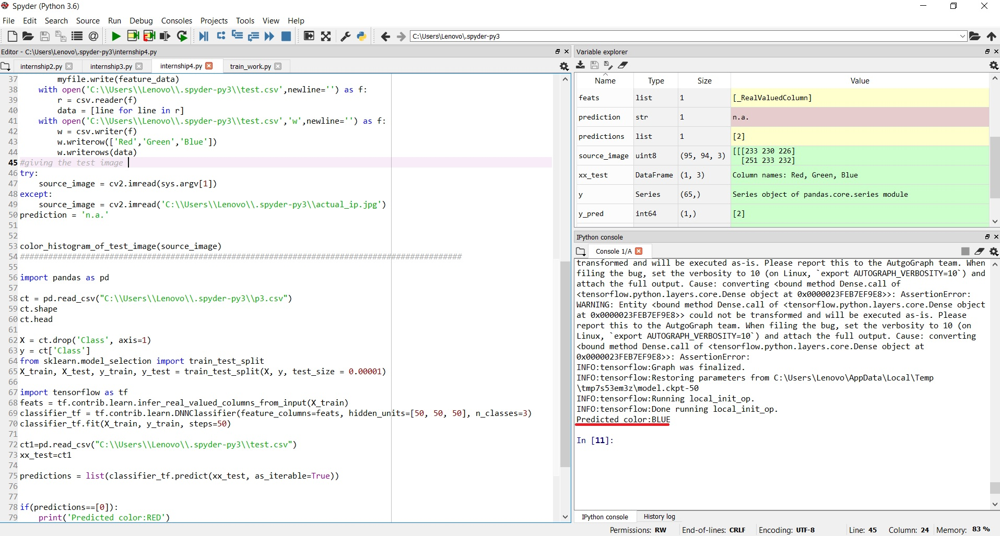

# LP3_internship-COLOR RECONGNITION MODEL

The repository is for color recongnition model using tensorflow and SVM  
There are folders named 'red','green','blue' which contains the images of training dataset. 

1.There is a folder named "using_tensorflow" which has a color recongnition using tensorflow DNN classifier. 
  The first python file "create_dataset" creates a csv file with the pixel values for each training image.Here in the class column 0=red      color 1=green 2=blue    
  The second program is the code for the  model to recongnize the color. 
  **Note:This requires the tensorflow 1.14.0 version**  
  To install tensorflow 1.14.0  using conda  
    
    conda uninstall tensorflow
    conda install -c conda-forge tensorflow=1.13
   
  
  
2.The other folder "using_SVM" has a color recongnition model  using sklearn library and SVM . 
  The first python file "create_dataset" creates a csv file with the pixel values for each training image.Here in the class column 0=red      color 1=green 2=blue    
   
   
  
  The image actual_ip is the image given as the test_image according to the LP3 statement
   
   
  
